# Addressables

# 一、引入

**1**、在Unity编辑器中，Window下滑栏目中选择打开PackageManager，选择Packages：Unity Registry / In Project，搜索或者下滑找到[Addressables](https://docs.unity.cn/cn/2020.2/Manual/com.unity.addressables.html)，点击右侧Install（下载）即可。（Samples中包含一些示例可以下载后辅助学习）

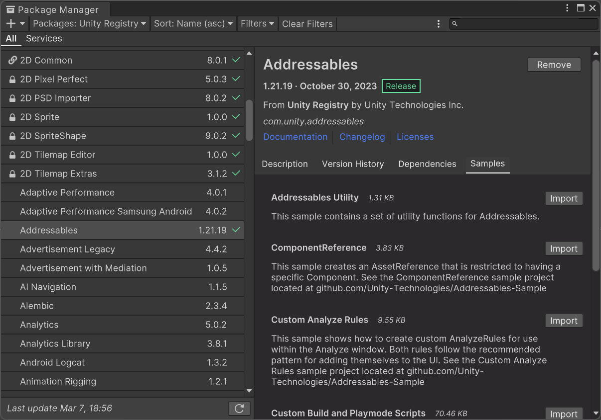

# 二、使资源变成可寻址资源
**1**、在Window下滑栏目中选择Asset Manafement,选择Addresables选择Groups打开Addressables Groups窗口。（由于此窗口需要经常用到，所以请把它拖拽设置为**常用窗口**）

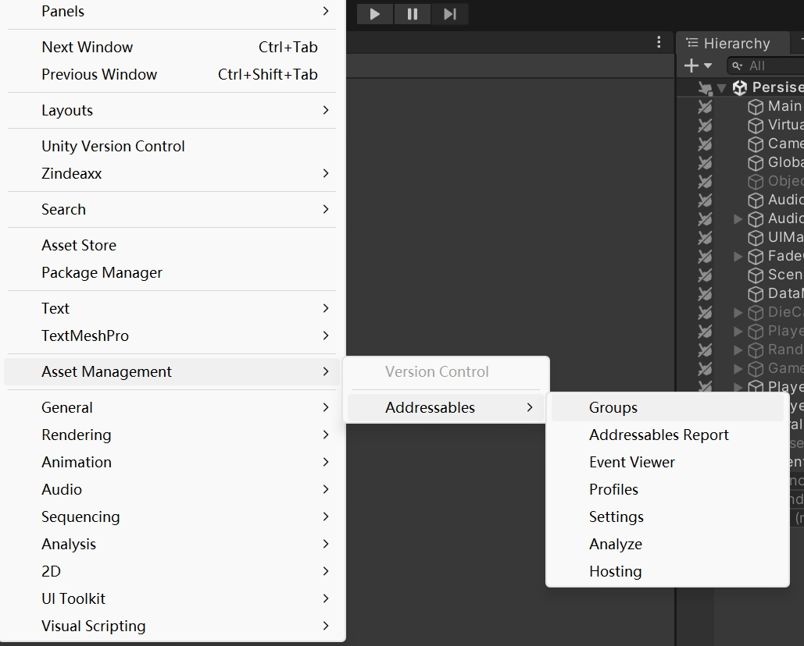

**2**、选择相应的**美术资源或者游戏预制体**，查看Inspecter窗口中可以看到一个可供勾选的选项，选择勾选即可。（也可直接将资源拖入到分组中）勾选后，Unity会自动创建AddressableAssetsData的资源文件。

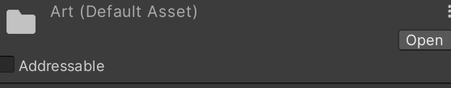

==注意== ：[Resources](https://docs.unity.cn/cn/2020.2/ScriptReference/Resources.html)目录下资源如果变为寻址资源会移入到Resources_moved文件夹中。


**原因**：Resources目录下的资源会被打包出去，如果Resources目录下的资源如果变为寻址资源便意味着以后的资源管理用Addressable，未必避免资源的重复打包造成空间的浪费，Unity会自动将其迁移。

**3**、在Addressables Groups窗口中可新建分组（第一个是依照现有模板创建，第二个是创建空白组，一般情况下选择第一种）

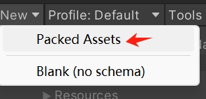

添加的资源可自行选择分组

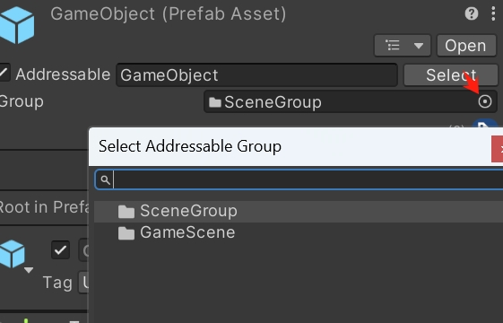

资源初次加入分组时会显示具体的路径和名称可以右键单击分组选择简单名称。

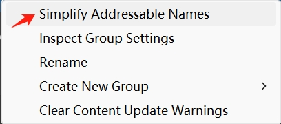


**4**、如需移除资源可直接选择相应资源按Delet删除或者在Inspecter窗口中取消勾选Addressable。

==注意==：一定会存在一个默认组，且不可删除，默认组可右键组进行自行选择设置。


# 三、 资源的加载
## （一） 指定资源的异步加载
1、使用 Asset References拖拽赋值
(1) 、引入命名空间
(2) 、分类（不止示例中的类型）

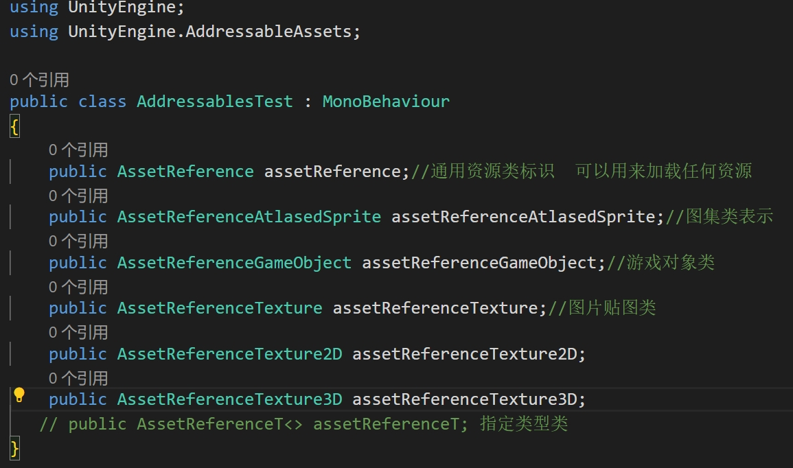
（3）、Addresables资源均使用异步加载
- **简单理解异步加载**：假如你是一位餐厅的服务员，你会给每个客人一个菜单，并告诉他们点好菜之后需要等待一会儿。然后你可以在菜烧好之前继续为其他客人提供服务、处理其他任务，或者与其他服务员协作。当厨房准备好某个菜时，你会被通知，然后回到该客人那里将菜送达，这就是一个异步加载。
- 异步加载需要等待加载完成才可以进行资源的使用，需要利用事件或者委托的方式等待异步加载完成，因此，此处可以理解为利用一个临时变量来记录异步加载的句柄（任务），当任务完成时会（Call Bcke)，可以通过这个临时变量来监听。

> AsyncOperationHandle - 异步操作句柄

> Call Back - 回调（表示在某个操作完成后，应该执行的下一项操作。）
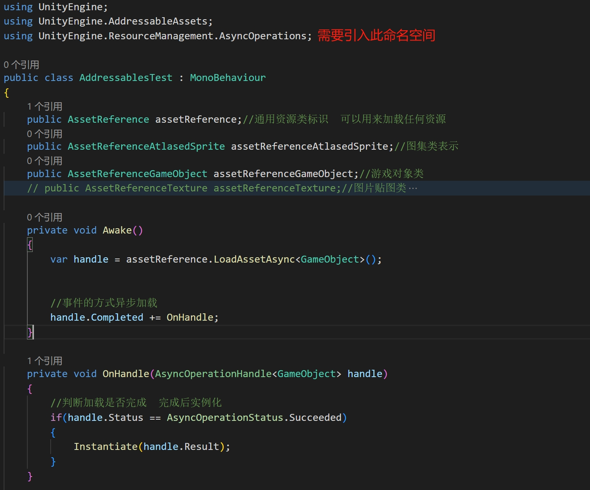

代码可利用[Lambda](https://learn.microsoft.com/zh-cn/dotnet/csharp/language-reference/operators/lambda-expressions)表达式进行简写

```
	assetReference.LoadAssetAsync<GameObject>().Completed += (handle) =>
	{
	     //判断加载是否完成  完成后实例化
	     if(handle.Status == AsyncOperationStatus.Succeeded)
	     {
	         Instantiate(handle.Result);
	     }
	 };
```

（4）、赋值
- 在Unity界面进行（可直接赋值在Addrablessable分配好的资源，未分配好的资源若拖拽赋值，会自动分配到默认组）。|  启动之前请更改Play Mod Script到Simulate Groups (advanced）==原因见下文==)。

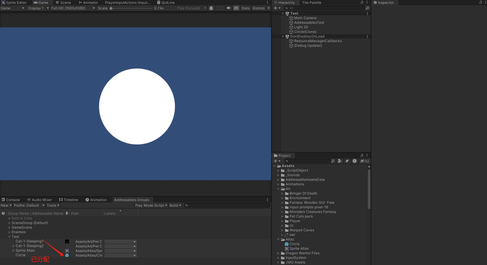
 - **注意**：未指定类型的资源在异步加载时需要指定，指定的直接加载即可。

 - **应用**：指定资源的加载在实际商业项目中并不常用，因为它必须在脚本中声明各种标识类（各种类型的资源）来指定加载资源，不够灵活。而在实际商业项目中通常使用配置表来动态加载资源。

  ## （二） 标签（Label）

1、可自定义标签对资源进行分类

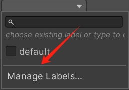

2、作用
   - 工作方式类似与字典，标签是键，对应的资源为值，动态加载资源时，通过标签查找资源。
   
3、为什么学习标签？

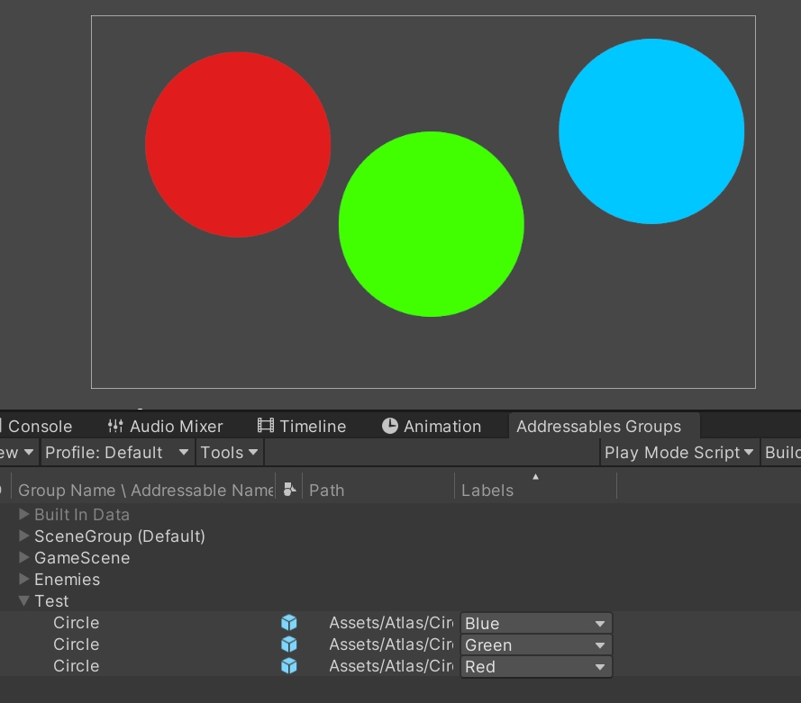

- 在Addressables Groups中，相同作用的不同资源，它们的名字可相同，这时可以通过标签来区分它

> 补充：通过标签可以来约束资源的选取，约束可以有多个。

```
 [AssetReferenceUILabelRestriction("Blue")]

```


## （三）、动态资源的异步加载
1、使用名字或标签加载单个资源（以**资源名字**为例）
- 代码部分
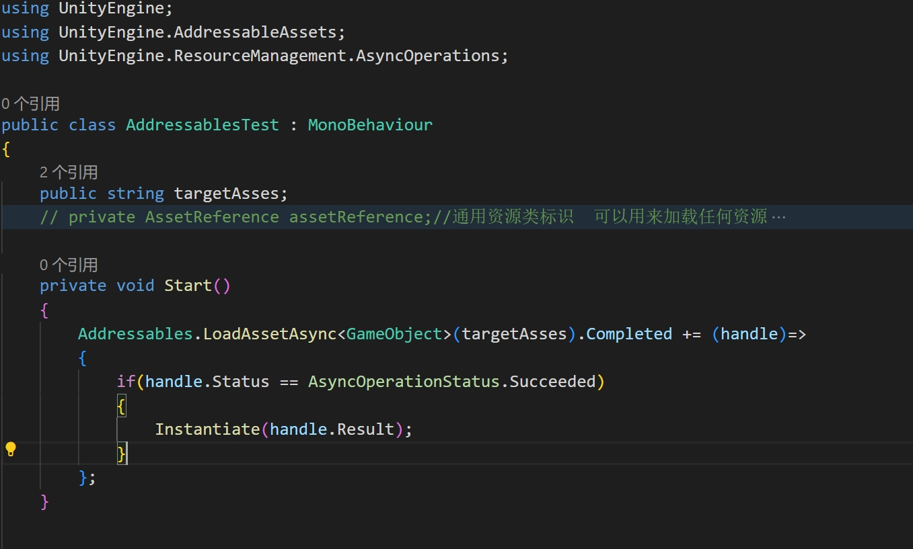
- 效果
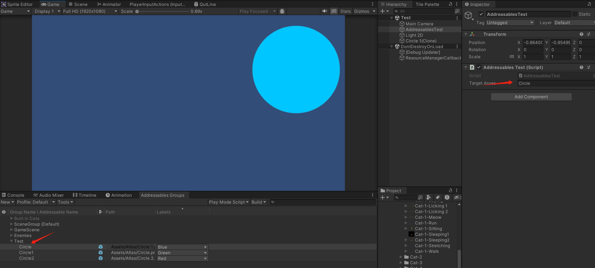
2、使用标签或者名字加载多个资源（以**资源标签**为例）
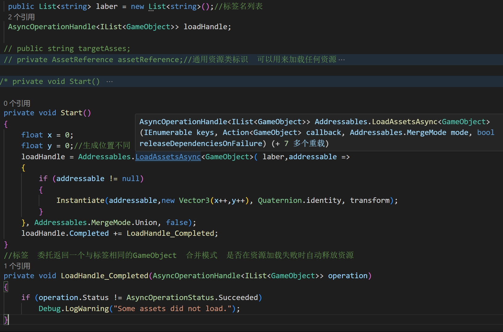

- 合并模式（[Addressables.MergeMode](https://docs.unity3d.com/Packages/com.unity.addressables@1.16/api/UnityEngine.AddressableAssets.Addressables.MergeMode.html)）：
None:不合并，使用第一组结果。


UseFirst：合并，使用第一组结果。


Union：合并，使用结果的并集。


Intersection：合并，使用结果的交集。

- releaseDependenciesOnFailure
True:自动处理依赖资源的释放，也会将已经加载成功的资源释放掉
False:手动释放，有资源加载失败时会停止，可以在失败时执行特定的错误处理逻辑，例如显示错误消息、记录日志或尝试其他资源加载路径。
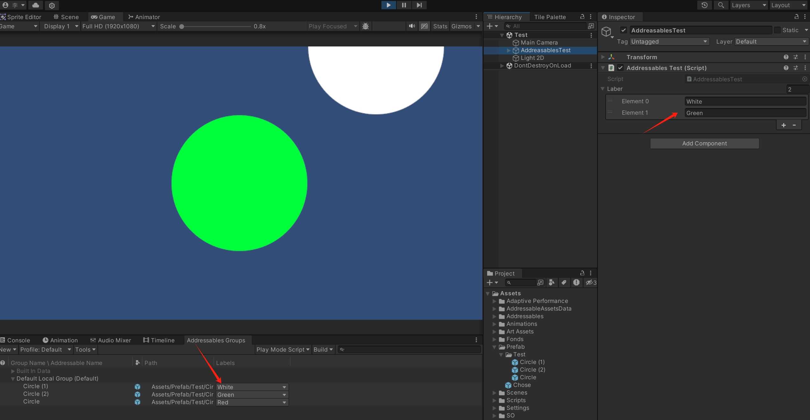

## （四）、总结
- 利用标签和名字都可以进行动态资源的加载。
- 可以利用标签和资源共同决定加载某个资源。
- 利用标签或者名字加载单个资源时的句柄，可理解为一个任务，当任务完成时，返回的是资源的名字或者标签。同样的加载多个资源时，返回的是资源的名字或者标签的列表。
- 动态加载多个资源时，不是加载多个句柄，而是加载一个List句柄，这个List里面有多个资源。

==注意==：加载单个资源是对这个**资源句柄**的回调，加载多个资源是对**多个资源**的回调。


# 四、资源的释放
## （一）同步与异步的对比
- 一般加载中通常使用的：**Instantiate** 来实例化预制。
同步实例化问题：
会等到实例化结束才继续运行
大量加载容易造成卡顿。
- 使用Addressables时 使用**InstantiateAsyns**替换Instantiate :
异步实例化：
系统不会等待
调用完成时回来继续执行
大量实例化不会卡住系统。


## （二）Release释放资源

```
public string targetAsses;
private GameObject target;

 private void Start() 
 {
     LoadGameObj();
 }

void LoadGameObj()
{
    
    Addressables.LoadAssetAsync<Sprite>(targetAsses).Completed += (handle) =>
    {
       target.GetComponent<SpriteRenderer>().sprite = handle.Result;
		//Addressables.Release(handle);
    };
}
public void DestroyObj()
{
	//场景中按钮点击调用
     Addressables.Release(target.GetComponent<SpriteRenderer>().sprite); 
 }


```
- Release释放不需要实例化资源


## (三)ReleaseInstance释放资源

```
public string targetAsses;
public GameObject target;
 private void Start() 
 {
      Addressables.InstantiateAsync(targetAsses).Completed += (handle)=>
      {
        	target = handle.Result;
      };
  }
public void DestroyObj()
{
     Addressables.ReleaseInstance(target);
     
 }
```
- ReleaseInstance释放的是实例化资源。

==释放的资源要与加载的资源相同==

> 使用LoadAssetAsync加载然后使用Instantiate实例化的，是不能通过ReleaseInstance来进行释放资源的，通过Release来释放也只能传递句柄（handle）来释放。


# 五、资源打包时配置概述相关
1、点击Profile选择点击Manager Profiles打开Addressable Profiles窗口，Profiles其实就是配置文件打包和加载使用的路径，下面内容会有具体用法

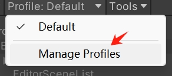
# 六、工具相关（Tools）

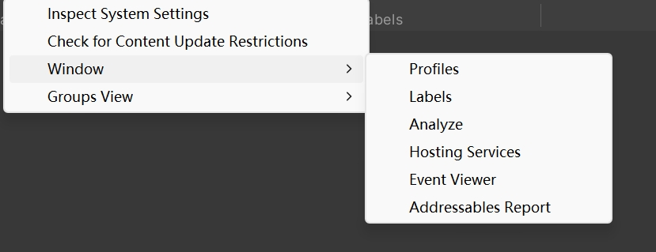

（一）检查系统设置：打开Addressable Settings。


（二） 检查内容更新限制：更新前，检查内容更新的限制。


（三）Profiles：配置文件 —— 配置文件包含一组可寻址构建脚本使用的变量。这些变量定义了保存资源的位置以及在运行时加载数据的位置等信息。

1、Local：为本地内容定义两个路径变量：

（1）Local.BuildPath：设置使用此本地打包资源保存路径。

（2）Local.LoadPath：加载应用程序本地安装的资产的位置。

2、Remote：为远程内容定义两个路径变量：

（1）Remote.BuildPath：设置使用此远程打包资源保存路径。

（2）Remote.LoadPath：从中下载远程内容和目录的 URL。

3、BuildTarget：构建目标的名称

（四）Event Viewer：事件查看器 —— 可寻址系统使用Event Viewer窗口来监控资产的内存管理。此窗口可以显示应用程序何时加载和卸载资产，并显示所有可寻址系统操作的引用计数。此窗口还显示了应用程序帧速率和分配的托管内存总量的大致视图。我们可以使用这些图表来检测可寻址事件（例如加载和释放资产）如何影响应用程序性能，并检测您从未释放的资产。

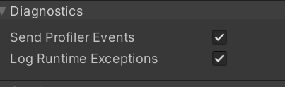
勾选后启动会在打开的窗口观察到下图
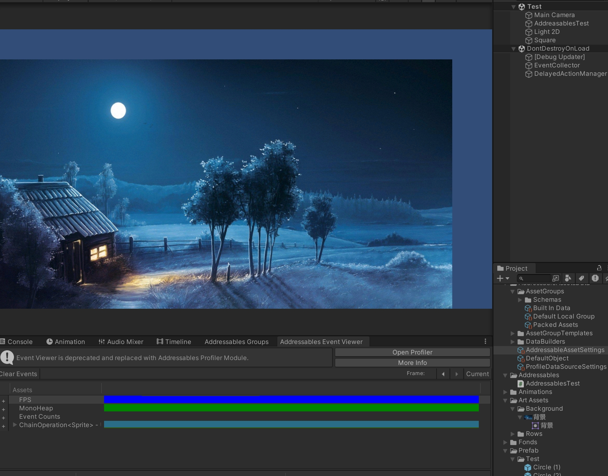

（五） Analyze：分析工具 —— 分析工具是一种收集有关项目的可寻址布局信息的工具。在某些情况下，Analyze 可能会采取适当的措施来清理您的项目状态。
(初次点开时如果是空的，点击下Fix Selected Rules即可，有可能会切换场景)
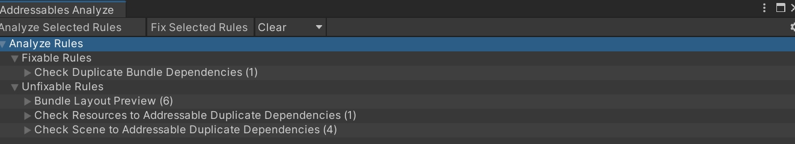
- Check Duplicate Bundle Dependencies（检查重复Bundle包依赖）：此规则会扫描所有组内资源的布局来检查可能重复的资源，里面的文件均可以选中右键点击后可选择运行方式。
-  Check Resources to Addressable Duplicate Dependencies：检查AB包和Resources文件夹里的资源是否存在重复依赖
- Check Scene to Addressable Duplicate Dependencies：检查AB包和Unity编辑器场景列表里的场景是否存在重复依赖
- Bundle Layout Preview：AB包的本体和依赖项

（六） Hosting：托管服务 —— 托管服务提供了一个集成工具，用于使用可寻址资产配置数据从 Unity 编辑器中将打包内容提供给**本地或网络连接的应用程序**构建托管服务可以在测试打包内容时提高迭代速度，还可以为本地和远程网络上的连接客户端提供内容（可以在本地模拟使用服务器功能的工具。）


==此处功能具体使用方法见下文热更部分==


（七） 组视图：设置组窗口显示选项（不经常使用）


1、显示 Sprite 和子对象地址：显示 Group 列表中Sprite 的子对象或仅显示父对象


2、带破折号的组层次结构：启用以显示名称中包含破折号的组。


# 七、Play Mod Script 播放模式脚本相关（编辑器模式下如何运行）
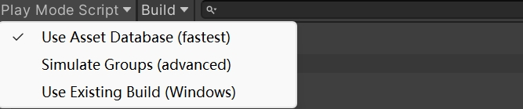
- 1 、Use Asset Database (fastest)  ：直接使用资源数据库（直接加载Assets目录下的资源），这是最快的加载资源方式，不需要构建可寻址资源内容。一般开发时不选择此，因为开发者需要测试资源是否可以正常从AB包中加载。（加载的资源会被缓存在内存中，不会被释放）


-  2、Simulate Groups (advanced) ： 模拟组后期加载，不需要创建AB包，不需要打包，通过ResourceManager代码模拟真实情况下的资产和文件的加载。（一般开发时选用此模式，加载的资源会被缓存在内存中，不会被释放）


-  3、Use Existing Build (Windows) ：加载AB包资源，一般在最总测试版使用（加载的资源不会被缓存在内存中，资源会被嵌入到所选择构建文件中，游戏运行时，这些资源将从构建文件加载到内存中供游戏使用，关闭后会被释放）


# 八、构建打包资源

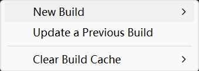

- 1、New Build：打包AB包


- 2、Update a Previous Build ：更新以前的版本（更新AB包）


- 3、Clear Build Cache ：清理AB包

# 九、热更


## （一）Group相关设置


1、选择要设置的组，在Inspeter窗口中可查看到具体的设置

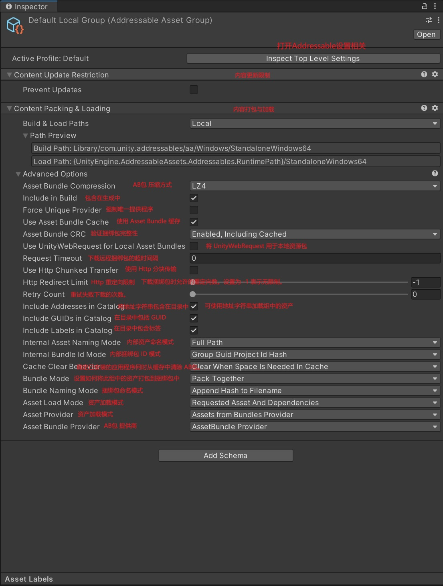
2、内容更新限制
（1） 勾选 —— 不会移动任何资产。在进行更新构建时，如果捆绑包中的任何资产发生更改，则会重新构建整个捆绑包。
（2） 不勾选 —— 如果捆绑包中的任何资产已更改，则“Check for Content Update Restrictions”工具会将其移动到为更新创建的新组。当您进行更新构建时，从此新组创建的 AB包中的资产将覆盖现有捆绑包中的版本。（通常不勾选）
3、内容打包与加载
（1）Local 在本地的资产
（2） Remote 在远程的资产，需要到Addressables Profiles里去设置你的远程资源地址。
- Remote.BuildPath通常不改，只改Remote.LoadPath，更改成自己的资源服务器地址

> **Local 与 Remote的区别**
> Local(本地打包)：
1、本地打包是指将游戏或应用程序的所有资源（例如代码、图像、声音等）打包到本地设备上，以便在没有网络连接的情况下运行。
2、本地打包通常用于开发和测试阶段，以便快速迭代和调试。
> -  优点：
快速加载：本地打包的应用程序可以在没有网络延迟的情况下快速加载。
隐私和安全性：本地打包的应用程序不需要从远程服务器下载资源，因此用户数据更加安全。
> - 缺点：
更新困难：如果需要更新应用程序，必须重新打包并重新分发给用户。
资源占用：本地打包的应用程序占用设备存储空间。

>Remote(远程打包)：
1、远程打包是指将应用程序的资源存储在远程服务器上，应用程序在运行时从服务器动态加载这些资源。
远程打包通常用于在线游戏、应用程序和服务，以便实现热更新和动态内容。
> - 优点：
热更新：远程打包允许在不重新打包应用程序的情况下更新资源。这对于修复错误、添加新功能或改进游戏体验非常有用。
资源共享：多个设备可以共享相同的资源，减少了存储空间占用。
> - 缺点：
网络依赖：远程打包的应用程序需要网络连接才能加载资源。
延迟：资源加载可能受到网络延迟的影响。


4、压缩方式：
- Uncompression 不压缩：这种选项不对资源进行压缩，解压速度快，但包体较大，不太推荐使用
- LZ4：这种压缩方式稍大，但解压速度更快。它允许按需解压资源，内存占用较低，因此更推荐使用
- LZMA：这是默认的压缩格式。它将资源压缩成一个单一的LZMA流序列化数据文件。在使用之前，需要解压整个包体（LZMA压缩不适用于 WebGL 上的AB包。）

5、包含在生成中：启用此属性以在内容生成中包含此组中的资产。

6、强制唯一提供程序：启用此属性可对此组使用资源提供程序类的唯一实例。如果您对此组中的资产类型具有自定义提供程序实现，并且这些提供程序的实例不得在组之间共享，请启用此选项。

7、使用 Asset Bundle 缓存：启用此属性可高速缓存远程分发的捆绑包

8、将 UnityWebRequest 用于本地资源包：启用此属性可使用以下命令从此组加载本地 AB包存档
UnityWebRequestAssetBundle.GetAssetBundle。通过UnityWebRequestAssetBundle判断该AB包是不是已经下载如果下载那么直接从缓存目录加载，不然就下载到缓存目录再加载。（一般勾选）

9、Cache Clear Behavior（清除缓存行为）：Local一般用默认第一个，Remote通常会选择第二个，第二个意思是如果有资源更新了，加载新资源的时候会把本地的旧资源删除掉，避免本地下载的旧资源堆积太多 。

10、Bundle Mode（打包方式）：推荐单独打包或者按标签打包，这样的好处就是如果只是一个很小的资源需要热更，那么下载的时候就只需要下载这个小资源，不用下载很多不必要的资源，对用户体验会比较好。
## （二）Addressables Settings相关设置

> [不在具体阐述，详情可点击查看详情](https://docs.unity3d.com/Packages/com.unity.addressables@1.21/manual/AddressableAssetSettings.html#profile)

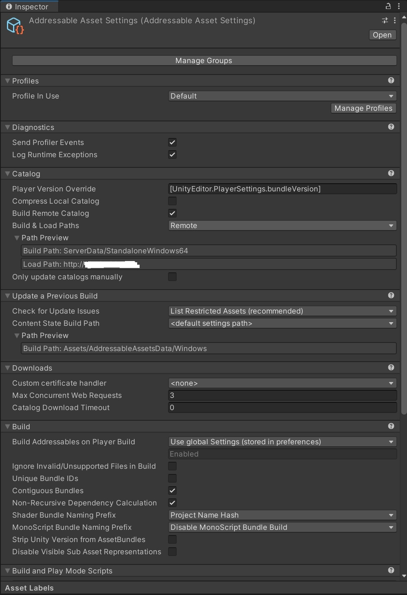
1、Profile In Use (配置文件使用) : 通过设置不同的Profiles，我们可以管理不同资源服务器的下载，比如内网、审核服等。
2、Only update catalogs manually（仅手动更新目录）：这个勾选的话是说这个catalog不会在自动更新，需要我们到了主界面，点击屏幕再更新，看看是否有更新，这个catalog保存的就是我们的资源信息，一般要做这种需要玩家确认下载的时候需要会勾选这个。
3、创建一个初始化对象列表的ScriptableObject
Cache Directory Override：{UnityEngine.Application.persistentDataPath} Unity会根据平台来选择资源更新路径。

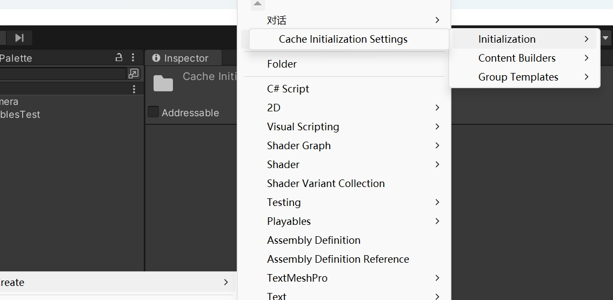
Addressables Settings 中的 Built & Load path 与 Group 中的 Built & Load path的几种组合

>1、 Addressables Settings 中的 Built & Load path 设置为 Remote，而 Group 中的 Built & Load path 设置为 Local：
——这将使你的资源在远程服务器上进行下载，但 Group 中的资源将被打包到应用程序包中，以便在本地加载。这样，你可以在不重新发布整个应用程序的情况下更新远程分发的资源。
2、Addressables Settings 中的 Built & Load path 设置为 Local，而 Group 中的 Built & Load path 设置为 Remote：
——这将导致资源被打包到应用程序包中，但 Group 中的资源将从远程服务器下载。这对于需要在本地加载的资源进行远程更新非常有用。
3、Addressables Settings 中的 Built & Load path 和 Group 中的 Built & Load path 都设置为 Remote：
——这将使所有资源都在远程服务器上进行下载。这对于需要完全远程分发的应用程序或游戏非常有用。
4、Addressables Settings 中的 Built & Load path 和 Group 中的 Built & Load path 都设置为 Local：
——这将导致所有资源都被打包到应用程序包中，以便在本地加载。这对于不需要远程下载的资源非常适用。

==到此相关设置已经完成==
## （三）实现本地热更
1、先在场景中利用代码生成一个游戏物体

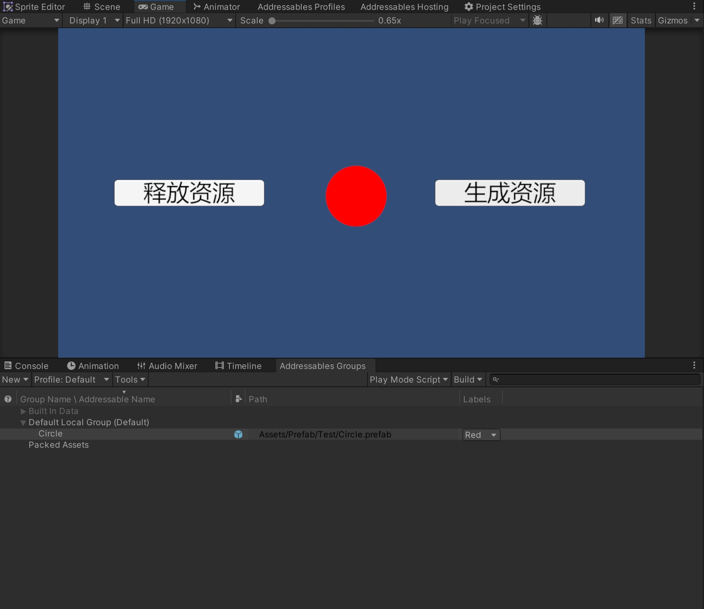
2、Build后可在与Assets同级目录下的SaveData文件夹中可以找到打包的资源目录，在【Library\com.unity.addressables\user\Windows\StandaloneWindows64】下可以找到打包的文件

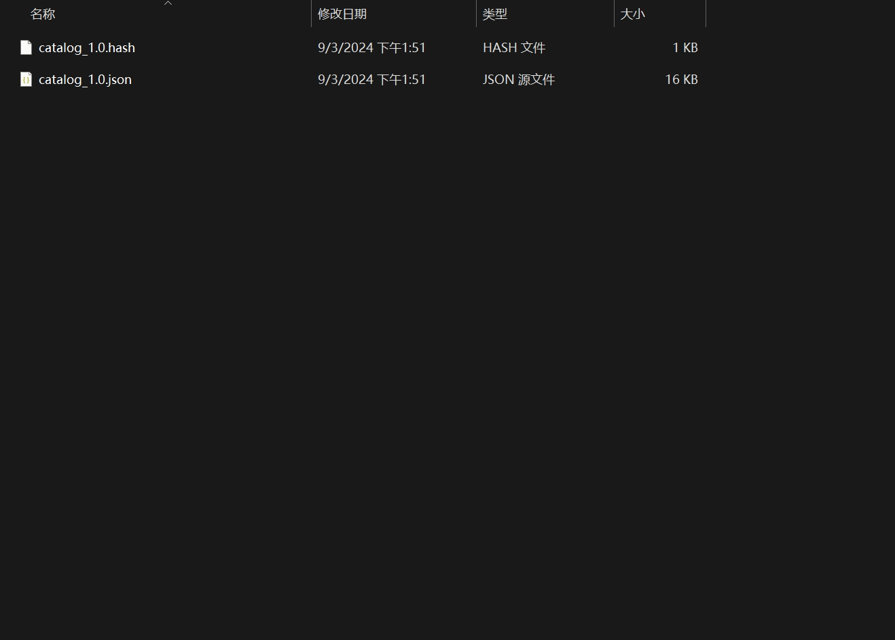
3、打包成exe文件运行查看效果


4、更改组中的预制体

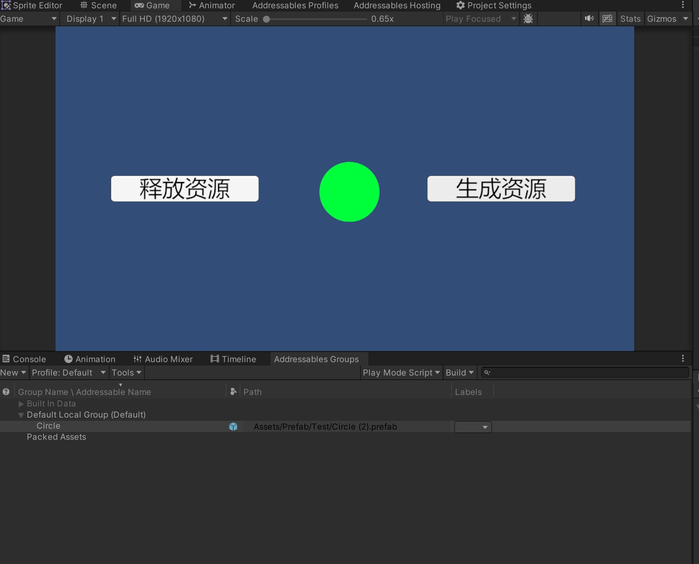
==此处更改后的预制体的名字（key）要与之前的相同==
5、Build → Update a Previous Build ，然后选择unity的Build And Run，Unity会自动选择第一次打包时的文件夹，启动后可以发现原本exe文件中的红色小球变成了绿色

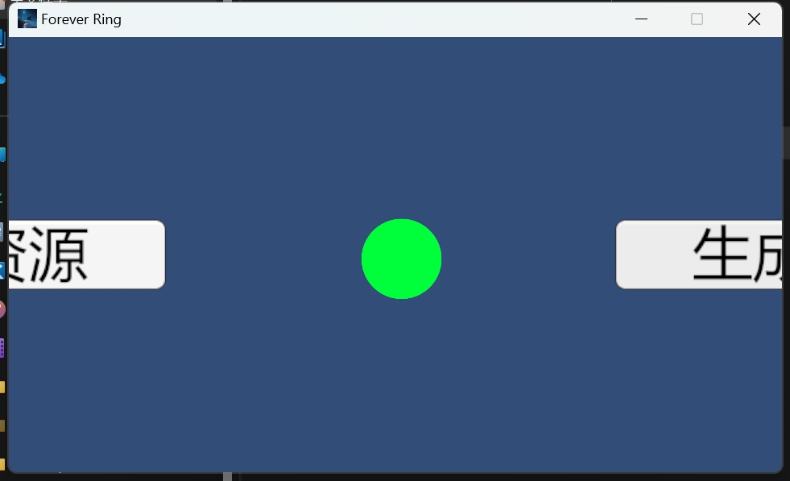
## （四）模拟远程热更
1、将Group的 Built & Load path 设置为Remote，LoadPath的地址可在Profiles中选择Costom后修改，没有的可不动。

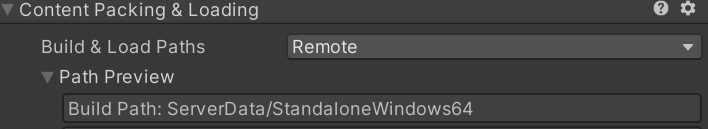
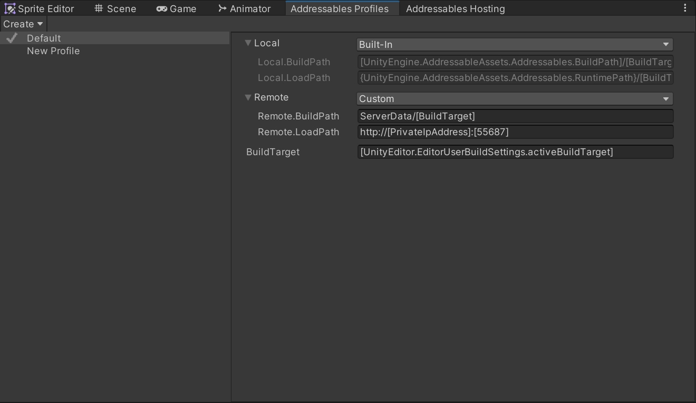
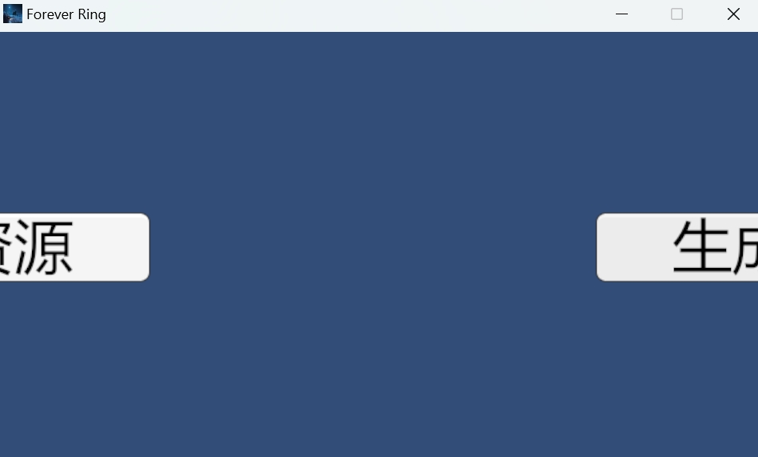
> 如果此时直接在上面本地更新的基础上直接进行更新打测会出现资源丢失的情况。
> 无法生成物体，因为在本地更新中我们将默认组设置成了本地组，而在这里又将它设置成了远程组


2、如何在保留本地更新的情况下加入远程更新？只需要新建远程组，将要加入的远程资源加入即可
- 利用Unity内置的Host服务模拟玩家在服务器上远程加载资源

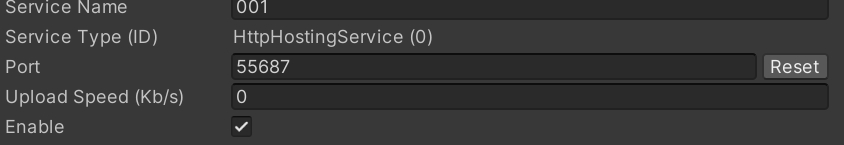


3、设置完成后将Play Mod Script播放模式设置为Use Existing Build (Windows)，模拟真实加载，在启动之前需要Update a Previous Build,编译完成后启动即可。


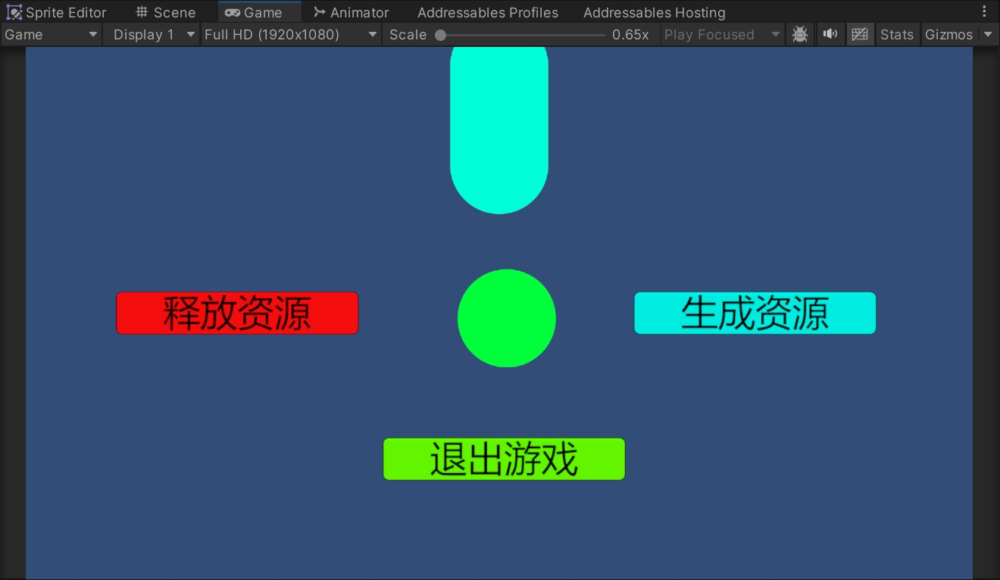
这里的圆柱便是一个远程资源。
代码部分：

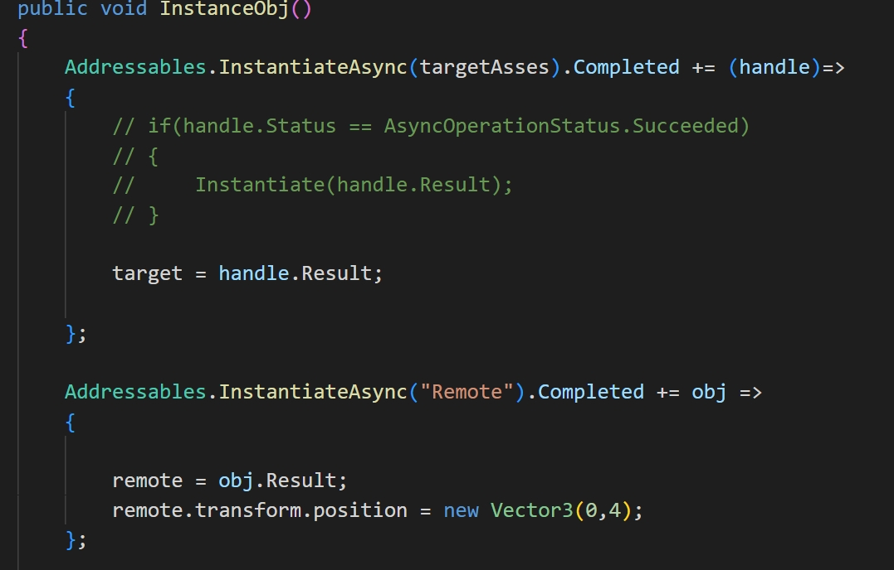
# 十、各种报错问题
## （一）接口正在使用


解决方法：点击右侧Reset更换一个即可。


**内容可能看上去比较困难，但实际上手时其实没有那么复杂**

--此内容持续更新中--